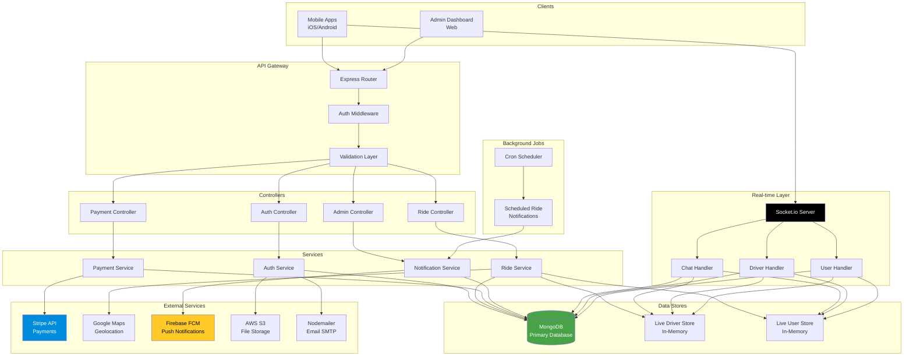

<div align="center">

# 🚗 RideHive Backend

### *Enterprise-Grade Ride-Sharing Platform API*

[](https://nodejs.org)
[](https://expressjs.com)
[](https://mongodb.com)
[](https://socket.io)
[](https://jwt.io)
[](https://stripe.com)
[](https://firebase.google.com)
[](https://aws.amazon.com/s3)
[](https://opensource.org/licenses/MIT)

[Features](#-core-features) • [Tech Stack](#-tech-stack) • [Architecture](#-architecture) • [Installation](#-quick-start) • [API Docs](#-api-endpoints) • [Database](#-database-schema)

</div>

---

## 🎯 Overview

**RideHive Backend** is a production-ready, scalable REST API and WebSocket server powering a comprehensive ride-sharing platform. Built with Node.js and Express, it handles multi-role authentication, real-time ride tracking, payment processing, and admin management with enterprise-level performance and security.

### 🌟 Why RideHive?

- ⚡ **High Performance** - Optimized MongoDB queries with geospatial indexing
- 🔐 **Multi-Authentication** - Email/Password, Google OAuth, Apple Sign-In
- 📡 **Real-time Everything** - Live tracking, chat, and instant notifications
- 💳 **Payment Ready** - Full Stripe integration with card management
- 🚕 **Multi-Service** - Instant rides, scheduled bookings, food & package courier
- 🛡️ **Production Hardened** - Comprehensive error handling and security measures
- 👥 **Multi-Role System** - Admin, User, and Driver roles with granular permissions

---

## ✨ Core Features

### 🔐 Authentication & Authorization
- 📧 **Email/Password Authentication** - Secure registration with OTP verification
- 🌐 **Social Login** - Google OAuth 2.0 and Apple Sign-In integration
- 🎫 **JWT Token Management** - Access tokens with revocation support
- 👥 **Multi-Role System** - Admin, User, and Driver roles
- 🔒 **Account Security** - Token invalidation, status management, soft delete
- 🔄 **Password Management** - Secure reset with OTP verification

### 🚕 Ride Management
- 🚗 **Instant Ride Booking** - Real-time driver matching with geospatial queries
- 📅 **Scheduled Rides** - Book rides in advance with automated notifications
- 🍔 **Food Courier Service** - Dedicated food delivery with separate pricing
- 📦 **Package Courier Service** - Secure package delivery tracking
- 📍 **Live Tracking** - Real-time driver location updates via WebSocket
- 💰 **Dynamic Pricing** - Distance-based fare calculation for multiple vehicle types
- ⭐ **Rating System** - Two-way ratings and reviews for drivers and riders
- 📊 **Ride History** - Complete audit trail with detailed analytics

### 🚘 Vehicle Types & Pricing
- 🚙 **Standard Car** - $2.00/mile base rate
- 🚗 **Deluxe Car** - $3.00/mile premium rate
- 🏍️ **Motorcycle** - $1.00/mile economy rate
- 🍕 **Food Courier** - $10.00 flat rate
- ➕ **Additional Stops** - $5.00 per stop

### 💳 Payment System
- 💵 **Stripe Integration** - Secure payment processing with PCI compliance
- 💳 **Card Management** - Add, delete, and set default payment methods
- 🔄 **Payment Processing** - Automated payment intents for ride completion
- 🧾 **Transaction History** - Complete payment audit trail
- 💰 **Multi-Currency Support** - USD-based transactions
- 🔒 **3D Secure** - Enhanced security for card payments

### 📡 Real-time Communication
- 💬 **In-App Chat** - Real-time messaging between riders and drivers
- 📁 **File Sharing** - Upload and share files in chat (images, documents)
- 📍 **Live Location** - WebSocket-based GPS tracking with 2dsphere indexing
- 🔔 **Push Notifications** - Firebase Cloud Messaging for instant alerts
- 📢 **Event Broadcasting** - Real-time ride status updates
- 🔄 **Auto-Reconnection** - Resilient WebSocket connections

### 👨‍💼 Driver Features
- 🚗 **Vehicle Registration** - Multi-document upload (license plate, registration, insurance)
- ✅ **Admin Approval** - Driver verification workflow
- 📊 **Earnings Dashboard** - Track ride history and revenue
- 📍 **Location Broadcasting** - Real-time GPS updates to nearby riders
- ⭐ **Reputation System** - Star ratings and customer reviews
- 🚫 **Status Management** - Active/inactive/blocked status control

### 🛠️ Admin Dashboard
- 📊 **Analytics Dashboard** - Real-time statistics, graphs, and KPIs
  - Total rides, users, drivers, revenue
  - Ride statistics graph (daily/weekly/monthly)
  - Revenue growth charts
  - User acquisition metrics
- 👥 **User Management** - CRUD operations, blocking, ride history
- 🚗 **Driver Management** - Approval workflow, verification, blocking
- 🚘 **Vehicle Management** - Document verification and updates
- 🗺️ **Ride Monitoring** - Live tracking, driver assignment, status updates
- 📝 **Content Management** - Terms, Privacy Policy, FAQs (multi-language)
- ⚙️ **Ride Configuration** - Dynamic pricing and service settings
- 📢 **Notification Broadcasting** - Send push notifications to users/drivers

### 🤖 Automation & Jobs
- ⏰ **Scheduled Ride Notifications** - Automated reminders via cron jobs
- 📧 **Email Automation** - OTP verification, password reset emails
- 🔄 **Data Management** - TTL indexes for automatic OTP cleanup
- 🧹 **Session Management** - Automatic token expiration handling

---

## 🛠️ Tech Stack

### Core Backend


- **Runtime:** Node.js v14+
- **Framework:** Express.js ^5.1.0
- **Language:** JavaScript ES6+ with async/await

### Database & ORM


- **Database:** MongoDB with replica set support
- **ODM:** Mongoose ^8.20.0 for schema validation
- **Indexing:** Geospatial (2dsphere), compound, and TTL indexes
- **Queries:** Optimized aggregation pipelines

### Authentication & Security


- **Authentication:** jsonwebtoken ^9.0.2
- **OAuth:** passport ^0.7.0, passport-google-oauth20 ^2.0.0
- **Apple Sign-In:** apple-signin-auth ^2.0.0
- **Hashing:** bcryptjs ^3.0.2 (configurable salt rounds)
- **Validation:** express-validator for input sanitization

### Real-time & Communication


- **WebSockets:** socket.io ^4.8.1
- **Client:** socket.io-client ^4.8.1
- **Events:** Custom event handlers for chat, tracking, notifications

### Payment & Integrations


- **Payments:** stripe ^19.1.0
- **Maps:** @googlemaps/google-maps-services-js ^3.4.2
- **Push Notifications:** firebase-admin ^13.6.0
- **HTTP Client:** axios ^1.13.1

### Cloud & Storage


- **File Storage:** @aws-sdk/client-s3 ^3.911.0
- **File Upload:** multer ^2.0.2, multer-s3 ^3.0.1
- **Presigned URLs:** Secure temporary access to S3 objects

### Utilities & Tools


- **Email:** nodemailer ^7.0.9
- **Scheduling:** node-cron ^4.2.1
- **Date/Time:** moment-timezone ^0.6.0
- **UUID:** uuid ^13.0.0
- **Development:** nodemon ^3.1.10

---

## 🏗️ Architecture

### System Architecture



### MVC Architecture Pattern

```
┌─────────────────────────────────────────────────────────┐
│                    Client Layer                         │
│         (Mobile Apps, Admin Dashboard)                  │
└────────────────────┬────────────────────────────────────┘
                     │
┌────────────────────▼────────────────────────────────────┐
│              Presentation Layer                         │
│  ┌──────────┐  ┌──────────┐  ┌───────────────┐        │
│  │  Routes  │  │Middleware│  │  Validations  │        │
│  └──────────┘  └──────────┘  └───────────────┘        │
└────────────────────┬────────────────────────────────────┘
                     │
┌────────────────────▼────────────────────────────────────┐
│            Business Logic Layer                         │
│  ┌──────────────┐         ┌─────────────────┐         │
│  │ Controllers  │────────▶│    Services     │         │
│  └──────────────┘         └─────────────────┘         │
└────────────────────┬────────────────────────────────────┘
                     │
┌────────────────────▼────────────────────────────────────┐
│             Data Access Layer                           │
│  ┌──────────┐  ┌──────────────┐  ┌──────────┐         │
│  │  Models  │  │ Repositories │  │  Stores  │         │
│  └──────────┘  └──────────────┘  └──────────┘         │
└────────────────────┬────────────────────────────────────┘
                     │
┌────────────────────▼────────────────────────────────────┐
│          Infrastructure Layer                           │
│  MongoDB  │  AWS S3  │  Stripe  │  Firebase  │  SMTP  │
└─────────────────────────────────────────────────────────┘
```

---

## 💾 Database Schema

### Users Collection
```javascript
{
  email: String,                    // Unique, indexed
  password: String,                 // Bcrypt hashed
  role: Enum["admin", "user", "driver"],
  isVerified: Boolean,
  profileCompleted: Boolean,
  pushNotification: Boolean,
  isActive: Boolean,
  isDeleted: Boolean,
  fullName: String,
  phone: String,
  gender: Enum["male", "female", "other"],
  location: {
    type: "Point",
    coordinates: [Number, Number],  // [lng, lat], 2dsphere index
    address: String
  },
  profileImageKey: String,          // S3 key
  socialId: String,                 // Indexed
  socialType: Enum["google", "apple"],
  deviceType: Enum["android", "ios", "web"],
  deviceToken: String,              // FCM token
  stripeCustomerId: String,
  stripeAccountId: String,
  tokenInvalidBefore: Date,
  lastAuthToken: String,
  createdAt: Date
}
```

### RideRequest Collection
```javascript
{
  userId: ObjectId,                 // ref: User
  driverId: ObjectId,               // ref: User
  rideType: Enum["instant", "schedule", "courier-food", "courier-package"],
  vehicleType: Enum["car_standard", "car_deluxe", "motorcycle_standard"],
  from: {
    type: "Point",
    coordinates: [Number, Number],  // 2dsphere index
    address: String
  },
  to: {
    type: "Point",
    coordinates: [Number, Number],  // 2dsphere index
    address: String
  },
  distanceMiles: Number,
  fareUSD: Number,
  fareFoodUSD: Number,
  farePackageUSD: Number,
  status: Enum["created", "pending", "accepted", "ongoing", "completed", "cancelled"],
  createdAt: Date
}
```

### Vehicle Collection
```javascript
{
  driver: ObjectId,                 // ref: User, indexed
  carMakeModel: String,
  licensePlateNumber: String,
  color: String,
  vehicleType: String,
  rideOption: Enum["car_standard", "car_deluxe", "motorcycle_standard"],
  licensePlateKey: String,          // S3 document
  vehiclePictureKey: String,        // S3 image
  driverLicenseKey: String,         // S3 document
  vehicleRegistrationKey: String,   // S3 document
  taxiOperatorLicenseKey: String,   // S3 document
  insuranceCardKey: String,         // S3 document
  createdAt: Date
}
```

### Payment Collection
```javascript
{
  userId: ObjectId,                 // ref: User
  rideId: ObjectId,                 // ref: RideRequest
  amountUSD: Number,
  status: Enum["pending", "completed", "failed"],
  paymentId: String,                // Stripe Payment Intent ID
  metadata: Object,
  createdAt: Date
}
```

### Review Collection
```javascript
{
  userId: ObjectId,                 // ref: User, indexed
  driverId: ObjectId,               // ref: User, indexed
  rideId: ObjectId,                 // ref: RideRequest, unique index
  rating: Number,                   // 1-5
  review: String,
  isAnonymous: Boolean,
  createdAt: Date
}
```

### Additional Collections
- **UserCard** - Stripe payment methods with default card management
- **Notification** - In-app and push notification records
- **Chat** - Real-time messages with file attachments
- **OTP** - Temporary codes with TTL expiration
- **Content** - Terms, Privacy Policy (multi-language)
- **Faq** - Frequently asked questions
- **RideConfig** - Dynamic pricing and service configuration

### Database Relationships
```
     Users (1) ──────── (N) RideRequests
       │                      │
       │                      │
       │ (1)           (1)    │
       │                      │
       ├────── (N) Vehicles   │
       │                      │
       │ (1)           (1)    │
       │                      │
       ├────── (N) Reviews ───┘
       │                      
       │ (1)                  
       │                      
       ├────── (N) Payments   
       │                      
       │ (1)                  
       │                      
       └────── (N) UserCards  
```

---

## 🚀 Quick Start

### Prerequisites

- **Node.js** v14 or higher
- **MongoDB** 5.0+ (local or cloud instance)
- **AWS Account** (for S3 storage)
- **Stripe Account** (for payments)
- **Firebase Project** (for push notifications)
- **Google Cloud Account** (for Maps API & OAuth)
- **SMTP Server** (for emails)

### Installation

1. **Clone the repository**
   ```bash
   git clone https://github.com/yourusername/ridehive-backend.git
   cd ridehive-backend
   ```

2. **Install dependencies**
   ```bash
   npm install
   ```

3. **Environment Configuration**
   ```bash
   cp .env.example .env
   ```

4. **Configure `.env` file**
   ```env
   # Application
   PORT=4000
   APP_BASE_URL=http://localhost:4000
   LOCAL_UPLOADS=false
   
   # Database
   MONGO_URI=mongodb://localhost:27017/ridehive
   
   # JWT Authentication
   JWT_SECRET=your_super_secret_jwt_key_here
   JWT_EXPIRES_IN=7d
   JWT_RESET_SECRET=your_reset_token_secret
   JWT_RESET_EXPIRES=15m
   BCRYPT_SALT_ROUNDS=10
   
   # OTP Configuration
   OTP_EXPIRY_SECONDS=60
   OTP_EXPIRY_MINUTES=1
   OTP_RESEND_COOLDOWN_SECONDS=60
   
   # Email (SMTP)
   EMAIL_HOST=smtp.gmail.com
   EMAIL_PORT=587
   EMAIL_USER=your-email@gmail.com
   EMAIL_PASS=your-app-password
   
   # AWS S3
   AWS_ACCESS_KEY_ID=your_aws_access_key
   AWS_SECRET_ACCESS_KEY=your_aws_secret_key
   AWS_S3_BUCKET_NAME=ridehive-uploads
   AWS_REGION=us-east-1
   
   # Google Services
   GOOGLE_CLIENT_ID=your_google_client_id
   GOOGLE_CLIENT_SECRET=your_google_client_secret
   
   # Apple Sign-In
   APPLE_TEAM_ID=your_apple_team_id
   APPLE_KEY_ID=your_apple_key_id
   APPLE_PRIVATE_KEY=your_apple_private_key
   APPLE_CLIENT_ID=com.yourapp.service
   
   # Stripe
   STRIPE_SECRET_KEY=sk_test_your_stripe_secret_key
   ```

5. **Firebase Setup**
   - Download your Firebase Admin SDK service account JSON
   - Place it in `src/config/firebase-service-account.json`

6. **Database Setup**
   ```bash
   # Start MongoDB (if running locally)
   mongod --dbpath /path/to/data
   
   # The application will auto-create admin user on first run
   ```

7. **Start the Server**
   
   Development mode (with nodemon):
   ```bash
   npm start
   ```
   
   Production mode:
   ```bash
   node server.js
   ```

8. **Access the API**
   ```
   http://localhost:4000/health
   ```

### Docker Deployment

```bash
# Build Docker image
docker build -t ridehive-backend .

# Run container
docker run -p 4000:4000 --env-file .env ridehive-backend
```

### Initial Setup

On first run, an admin user is automatically created:
- **Email:** Admin email from initialization
- **Password:** Set during initialization
- Use admin credentials to access admin panel endpoints

---

## 📚 API Endpoints

### 🔐 Authentication Routes (`/api/auth`)

| Method | Endpoint | Description | Auth Required |
|--------|----------|-------------|---------------|
| POST | `/signup` | User registration | ❌ |
| POST | `/verify-otp` | Verify OTP for account activation | ❌ |
| POST | `/resend-otp` | Resend OTP code | ❌ |
| POST | `/login` | User login | ❌ |
| POST | `/forgot-password` | Request password reset | ❌ |
| POST | `/verify-reset-otp` | Verify reset OTP | ❌ |
| POST | `/reset-password` | Reset password with OTP | ❌ |
| POST | `/social-login` | Google/Apple social login | ❌ |
| POST | `/logout` | User logout | ✅ JWT |

### 👤 Profile Routes (`/api/profile`)

| Method | Endpoint | Description | Auth Required |
|--------|----------|-------------|---------------|
| POST | `/create-profile` | Create/update user profile | ✅ JWT |
| PATCH | `/update-profile` | Update profile information | ✅ JWT |

### 🚗 Vehicle Routes (`/api/vehicle`)

| Method | Endpoint | Description | Auth Required |
|--------|----------|-------------|---------------|
| POST | `/create-vehicle-details` | Create vehicle details (drivers only) | ✅ JWT (Driver) |
| PATCH | `/update-vehicle-details` | Update vehicle information | ✅ JWT (Driver) |
| GET | `/get-vehicle-details` | Get driver's vehicle | ✅ JWT (Driver) |

### 🚕 Ride Routes (`/api/rides`)

| Method | Endpoint | Description | Auth Required |
|--------|----------|-------------|---------------|
| POST | `/instant-ride` | Create instant ride request | ✅ JWT |
| GET | `/ongoing-rides` | Get user's ongoing rides | ✅ JWT |
| GET | `/user-schedule-rides` | Get user's scheduled rides | ✅ JWT (User) |
| GET | `/driver-schedule-bookings` | Get driver's scheduled rides | ✅ JWT (Driver) |
| GET | `/user-food-delivery-history` | Get food delivery history | ✅ JWT (User) |
| GET | `/user-ride-history` | Get user ride history | ✅ JWT (User) |
| GET | `/driver-ride-history` | Get driver ride history | ✅ JWT (Driver) |
| GET | `/recent-places` | Get recent pickup/drop locations | ✅ JWT |

### 💳 Card Routes (`/api/cards`)

| Method | Endpoint | Description | Auth Required |
|--------|----------|-------------|---------------|
| POST | `/add-card` | Add payment card to Stripe | ✅ JWT |
| GET | `/cards-list` | List user's saved cards | ✅ JWT |
| POST | `/card-activate` | Set default payment card | ✅ JWT |
| DELETE | `/delete-card` | Delete saved card | ✅ JWT |

### 💰 Payment Routes (`/api/payments`)

| Method | Endpoint | Description | Auth Required |
|--------|----------|-------------|---------------|
| POST | `/paynow` | Process ride payment | ✅ JWT |
| GET | `/:paymentId` | Get payment details | ✅ JWT |

### ⭐ Review Routes (`/api/reviews`)

| Method | Endpoint | Description | Auth Required |
|--------|----------|-------------|---------------|
| POST | `/add-review` | Add ride review/rating | ✅ JWT |
| GET | `/get-driver-reviews` | Get driver's reviews | ✅ JWT |

### 💬 Chat Routes (`/api/chat`)

| Method | Endpoint | Description | Auth Required |
|--------|----------|-------------|---------------|
| POST | `/chat-uploads` | Upload chat files (images, documents) | ✅ JWT |

### ⚙️ Settings Routes (`/api/settings`)

| Method | Endpoint | Description | Auth Required |
|--------|----------|-------------|---------------|
| POST | `/push-notification` | Update push notification settings | ✅ JWT |
| POST | `/account-status` | Update account active/inactive status | ✅ JWT |
| GET | `/privacy-policy` | Get privacy policy | ❌ |
| GET | `/terms-and-conditions` | Get terms and conditions | ❌ |
| GET | `/faqs` | Get frequently asked questions | ❌ |
| POST | `/change-password` | Change user password | ✅ JWT |
| DELETE | `/delete-account` | Soft delete user account | ✅ JWT |

### 🔔 Notification Routes (`/api/notifications`)

| Method | Endpoint | Description | Auth Required |
|--------|----------|-------------|---------------|
| GET | `/get-notifications` | Get user notifications | ✅ JWT |
| POST | `/mark-read-notification` | Mark notification as read | ✅ JWT |

---

### 👨‍💼 Admin Routes (`/api/admin`)

#### Admin Authentication

| Method | Endpoint | Description | Auth Required |
|--------|----------|-------------|---------------|
| POST | `/login` | Admin login | ❌ |
| POST | `/logout` | Admin logout | ✅ JWT (Admin) |
| GET | `/get-profile` | Get admin profile | ✅ JWT (Admin) |
| PATCH | `/update-profile` | Update admin profile | ✅ JWT (Admin) |
| PATCH | `/change-password` | Change admin password | ✅ JWT (Admin) |

#### Admin Dashboard (`/api/admin/dashboard`)

| Method | Endpoint | Description | Auth Required |
|--------|----------|-------------|---------------|
| GET | `/` | Get dashboard statistics | ✅ JWT (Admin) |
| GET | `/graphs/rides` | Ride statistics graph data | ✅ JWT (Admin) |
| GET | `/graphs/revenue` | Revenue growth graph | ✅ JWT (Admin) |
| GET | `/graphs/users` | User acquisition graph | ✅ JWT (Admin) |

#### Admin User Management (`/api/admin/users`)

| Method | Endpoint | Description | Auth Required |
|--------|----------|-------------|---------------|
| GET | `/` | List all users (paginated) | ✅ JWT (Admin) |
| GET | `/:id` | Get user details | ✅ JWT (Admin) |
| PATCH | `/:id` | Update user information | ✅ JWT (Admin) |
| POST | `/:id/block` | Block/unblock user | ✅ JWT (Admin) |
| GET | `/:id/rides` | Get user's ride history | ✅ JWT (Admin) |

#### Admin Driver Management (`/api/admin/drivers`)

| Method | Endpoint | Description | Auth Required |
|--------|----------|-------------|---------------|
| GET | `/` | List all drivers (paginated) | ✅ JWT (Admin) |
| GET | `/:id` | Get driver details | ✅ JWT (Admin) |
| PATCH | `/:id` | Update driver information | ✅ JWT (Admin) |
| POST | `/:id/approve` | Approve driver application | ✅ JWT (Admin) |
| POST | `/:id/block` | Block/unblock driver | ✅ JWT (Admin) |
| GET | `/:id/rides` | Get driver's ride history | ✅ JWT (Admin) |

#### Admin Vehicle Management (`/api/admin/vehicles`)

| Method | Endpoint | Description | Auth Required |
|--------|----------|-------------|---------------|
| GET | `/` | List all vehicles (paginated) | ✅ JWT (Admin) |
| GET | `/:id` | Get vehicle details | ✅ JWT (Admin) |
| PATCH | `/:id` | Update vehicle information | ✅ JWT (Admin) |

#### Admin Ride Management (`/api/admin/rides`)

| Method | Endpoint | Description | Auth Required |
|--------|----------|-------------|---------------|
| GET | `/` | List all rides (paginated) | ✅ JWT (Admin) |
| GET | `/:id` | Get ride details | ✅ JWT (Admin) |
| POST | `/:id/assign` | Manually assign driver to ride | ✅ JWT (Admin) |
| POST | `/:id/status` | Update ride status | ✅ JWT (Admin) |

#### Admin Content Management (`/api/admin/content`)

| Method | Endpoint | Description | Auth Required |
|--------|----------|-------------|---------------|
| GET | `/terms-conditions` | Get terms and conditions | ✅ JWT (Admin) |
| PATCH | `/terms-conditions` | Update terms and conditions | ✅ JWT (Admin) |
| GET | `/privacy-policy` | Get privacy policy | ✅ JWT (Admin) |
| PATCH | `/privacy-policy` | Update privacy policy | ✅ JWT (Admin) |
| GET | `/faqs` | List all FAQs | ✅ JWT (Admin) |
| POST | `/faqs` | Create new FAQ | ✅ JWT (Admin) |
| GET | `/faqs/:id` | Get FAQ details | ✅ JWT (Admin) |
| PATCH | `/faqs/:id` | Update FAQ | ✅ JWT (Admin) |
| DELETE | `/faqs/:id` | Delete FAQ | ✅ JWT (Admin) |

#### Admin Ride Configuration (`/api/admin/ride-config`)

| Method | Endpoint | Description | Auth Required |
|--------|----------|-------------|---------------|
| GET | `/` | Get current ride configuration | ✅ JWT (Admin) |
| PATCH | `/update` | Update pricing and service settings | ✅ JWT (Admin) |

**Configurable Settings:**
- `carStandardRate` - Standard car rate per mile ($2.00 default)
- `carDeluxeRate` - Deluxe car rate per mile ($3.00 default)
- `motorcycleStandardRate` - Motorcycle rate per mile ($1.00 default)
- `courierFoodRate` - Food courier flat rate ($10.00 default)
- `addStopRate` - Additional stop charge ($5.00 default)
- `defaultRadiusMiles` - Default search radius (30 miles)
- `maxNotifyDrivers` - Max drivers to notify (200)

#### Admin Notifications (`/api/admin/notifications`)

| Method | Endpoint | Description | Auth Required |
|--------|----------|-------------|---------------|
| POST | `/send` | Send broadcast notification | ✅ JWT (Admin) |
| GET | `/` | List sent notifications | ✅ JWT (Admin) |

---

## 🔌 WebSocket Events

### Connection
```javascript
// Connect with JWT token
socket.io.connect('http://localhost:4000', {
  auth: { token: 'your-jwt-token' }
});
```

### User Events

| Event | Direction | Description | Payload |
|-------|-----------|-------------|---------|
| `user:location:update` | Client → Server | Update user location | `{ latitude, longitude, address }` |
| `user:ride:request` | Client → Server | Request a ride | `{ from, to, vehicleType, rideType }` |
| `user:ride:cancel` | Client → Server | Cancel ride request | `{ rideId }` |
| `ride:status:update` | Server → Client | Ride status changed | `{ rideId, status, driver }` |
| `driver:location:update` | Server → Client | Live driver location | `{ driverId, latitude, longitude }` |

### Driver Events

| Event | Direction | Description | Payload |
|-------|-----------|-------------|---------|
| `driver:online` | Client → Server | Driver goes online | `{ latitude, longitude }` |
| `driver:offline` | Client → Server | Driver goes offline | `{}` |
| `driver:location:broadcast` | Client → Server | Broadcast GPS location | `{ latitude, longitude }` |
| `ride:accept` | Client → Server | Accept ride request | `{ rideId }` |
| `ride:reject` | Client → Server | Reject ride request | `{ rideId }` |
| `ride:arrive` | Client → Server | Arrived at pickup | `{ rideId }` |
| `ride:start` | Client → Server | Start ride | `{ rideId }` |
| `ride:complete` | Client → Server | Complete ride | `{ rideId }` |
| `ride:new:notification` | Server → Client | New ride request | `{ ride, user }` |

### Chat Events

| Event | Direction | Description | Payload |
|-------|-----------|-------------|---------|
| `chat:message:send` | Client → Server | Send chat message | `{ rideId, message, files }` |
| `chat:message:receive` | Server → Client | Receive chat message | `{ senderId, message, files, timestamp }` |
| `chat:typing:start` | Client → Server | User started typing | `{ rideId }` |
| `chat:typing:stop` | Client → Server | User stopped typing | `{ rideId }` |
| `chat:typing:status` | Server → Client | Typing indicator | `{ userId, isTyping }` |

---

## 🗂️ Project Structure

```
ridehive-backend/
├── .gitignore
├── Dockerfile
├── package.json
├── package-lock.json
├── README.md
├── server.js                    # Application entry point
│
├── scripts/
│   └── simulate.js              # Testing/simulation scripts
│
└── src/
    ├── config/
    │   ├── index.js             # Main configuration
    │   ├── aws-s3.js            # AWS S3 setup
    │   └── firebase-service-account.json
    │
    ├── controllers/             # Request handlers
    │   ├── auth-controller.js
    │   ├── ride-controller.js
    │   ├── payment-controller.js
    │   ├── profile-controller.js
    │   ├── vehicle-controller.js
    │   ├── card-controller.js
    │   ├── review-controller.js
    │   ├── chat-upload-controller.js
    │   ├── notification-controller.js
    │   ├── setting-controller.js
    │   └── admin/
    │       ├── admin-controller.js
    │       ├── admin-dashboard-controller.js
    │       ├── admin-user-controller.js
    │       ├── admin-driver-controller.js
    │       ├── admin-vehicle-controller.js
    │       ├── admin-ride-controller.js
    │       ├── admin-content-controller.js
    │       ├── admin-ride-config-controller.js
    │       └── admin-notification-controller.js
    │
    ├── models/                  # Mongoose schemas
    │   ├── User.js
    │   ├── RideRequest.js
    │   ├── Vehicle.js
    │   ├── Payment.js
    │   ├── Review.js
    │   ├── UserCard.js
    │   ├── Chat.js
    │   ├── Notification.js
    │   ├── OTP.js
    │   ├── Content.js
    │   ├── Faq.js
    │   └── RideConfig.js
    │
    ├── routes/                  # API routes
    │   ├── auth-routes.js
    │   ├── ride-routes.js
    │   ├── payment-routes.js
    │   ├── profile-routes.js
    │   ├── vehicle-routes.js
    │   ├── card-routes.js
    │   ├── review-routes.js
    │   ├── chat-upload-routes.js
    │   ├── notification-routes.js
    │   ├── settings-routes.js
    │   └── admin/
    │       ├── admin-routes.js
    │       ├── admin-dashboard-routes.js
    │       ├── admin-user-routes.js
    │       ├── admin-driver-routes.js
    │       ├── admin-vehicle-routes.js
    │       ├── admin-ride-routes.js
    │       ├── admin-content-routes.js
    │       ├── admin-ride-config-routes.js
    │       └── admin-notification-routes.js
    │
    ├── service/                 # Business logic
    │   ├── auth-service.js
    │   ├── ride-service.js
    │   ├── ride-service-instance.js
    │   ├── payment-service.js
    │   ├── profile-service.js
    │   ├── vehicle-service.js
    │   ├── card-service.js
    │   ├── review-service.js
    │   ├── chat-service.js
    │   ├── chat-upload-service.js
    │   ├── notification-service.js
    │   ├── setting-service.js
    │   └── admin/
    │       ├── admin-service.js
    │       ├── admin-dashboard-service.js
    │       ├── admin-user-service.js
    │       ├── admin-driver-service.js
    │       ├── admin-vehicle-service.js
    │       ├── admin-ride-service.js
    │       ├── admin-content-service.js
    │       ├── admin-ride-config-service.js
    │       └── admin-notification-service.js
    │
    ├── middlewares/             # Custom middleware
    │   ├── auth-middleware.js   # JWT verification
    │   ├── admin-middleware.js  # Admin role check
    │   ├── role-middleware.js   # Role-based access
    │   ├── authSocket.js        # Socket.io auth
    │   ├── errorHandler.js      # Global error handler
    │   ├── validate.js          # Request validation
    │   ├── multer-middleware.js # File upload config
    │   └── parse-formdata.js    # Form data parser
    │
    ├── validations/             # Input validation schemas
    │   ├── auth-validation.js
    │   ├── profile-validation.js
    │   ├── vehicle-validation.js
    │   ├── instant-ride-validation.js
    │   ├── card-validation.js
    │   ├── payment-validation.js
    │   ├── review-validation.js
    │   ├── setting-validation.js
    │   └── admin/
    │       ├── admin-validation.js
    │       ├── admin-user-validation.js
    │       ├── admin-driver-validation.js
    │       ├── admin-vehicle-validation.js
    │       ├── admin-ride-validation.js
    │       ├── admin-content-validation.js
    │       ├── admin-ride-config-validation.js
    │       └── admin-notification-validation.js
    │
    ├── sockets/                 # WebSocket handlers
    │   ├── index.js             # Socket.io setup
    │   ├── socket-manager.js    # Connection manager
    │   └── handlers/
    │       ├── user-handler.js  # User socket events
    │       ├── driver-handler.js# Driver socket events
    │       └── chat-handler.js  # Chat socket events
    │
    ├── repositories/            # Data access layer
    │   └── ride-repository.js
    │
    ├── stores/                  # In-memory stores
    │   ├── live-driver-store.js # Active drivers cache
    │   └── live-user-store.js   # Active users cache
    │
    ├── cron/                    # Scheduled tasks
    │   └── scheduledRideNotifications.js
    │
    ├── events/                  # Event emitters
    │   └── rideEvents.js
    │
    ├── lib/                     # Third-party integrations
    │   └── firebaseAdmin.js     # Firebase initialization
    │
    ├── utils/                   # Helper functions
    │   ├── catchAsync.js        # Async error wrapper
    │   ├── handlers.js          # Response handlers
    │   ├── jwt.js               # JWT utilities
    │   ├── otp.js               # OTP generation
    │   ├── mailer.js            # Email sender
    │   ├── sendNotification.js  # Push notification
    │   ├── profile-image.js     # Image processing
    │   ├── templateRenderer.js  # Email templates
    │   └── init-admin.js        # Admin initialization
    │
    ├── templates/               # Email templates
    │   └── otp-email.html
    │
    └── uploads/                 # Local file storage
        └── images/
```

---

## 🔐 Security Features

### Authentication & Authorization
✅ **JWT Authentication** - Access tokens with configurable expiration (7 days default)  
✅ **Token Revocation** - `tokenInvalidBefore` and `lastAuthToken` for security  
✅ **Multi-Role System** - Admin, User, Driver with granular permissions  
✅ **OAuth Integration** - Google and Apple Sign-In with secure token handling  
✅ **Account Status Validation** - Active/inactive/deleted checks on every request

### Data Protection
✅ **Password Hashing** - bcryptjs with configurable salt rounds (10 default)  
✅ **Input Validation** - express-validator for all user inputs  
✅ **SQL/NoSQL Injection Protection** - Mongoose ODM with schema validation  
✅ **XSS Protection** - Automatic HTML entity encoding  
✅ **Sensitive Data Encryption** - Secure storage of payment tokens

### API Security
✅ **CORS Configuration** - Controlled cross-origin access  
✅ **Request Size Limits** - Body parser limited to 10kb  
✅ **File Upload Restrictions** - Multer validation for type and size  
✅ **Error Handling** - No stack traces in production  
✅ **Rate Limiting** - Validation-based request throttling

### Database Security
✅ **Connection Security** - MongoDB URI with authentication  
✅ **Data Validation** - Mongoose schema-level validation  
✅ **Geospatial Indexing** - Optimized 2dsphere indexes  
✅ **TTL Indexes** - Automatic OTP cleanup for data hygiene

### File Security
✅ **Secure S3 Storage** - AWS presigned URLs with expiration  
✅ **File Type Validation** - MIME type checking  
✅ **Upload Size Limits** - Configurable max file size  
✅ **Access Control** - IAM-based S3 bucket policies

---

## 📈 Performance Optimizations

### Database Optimization
🚀 **Geospatial Indexing** - 2dsphere indexes for location queries  
🚀 **Compound Indexes** - Multi-field indexes for common queries  
🚀 **Query Optimization** - Aggregation pipelines with $match early  
🚀 **Connection Pooling** - Mongoose default connection pool

### Caching Strategy
🚀 **In-Memory Stores** - Live driver/user location caching  
🚀 **Session Management** - JWT stateless authentication  
🚀 **Static Asset Caching** - S3 presigned URL caching

### Real-time Optimization
🚀 **WebSocket Rooms** - Namespace isolation for efficient broadcasting  
🚀 **Event Throttling** - Location updates throttled to reduce load  
🚀 **Connection Management** - Auto-reconnection and heartbeat

### Application Performance
🚀 **Async/Await** - Non-blocking I/O operations  
🚀 **Error Handling** - catchAsync wrapper for clean error management  
🚀 **Lazy Loading** - On-demand data fetching  
🚀 **Pagination** - Limit/skip for large datasets

---

## 🧪 Testing

```bash
# Run simulation script
npm run simulate

# The script simulates:
# - User registration and login
# - Driver registration and approval
# - Ride booking and tracking
# - Payment processing
# - Real-time events
```

---

## 🤝 Contributing

Contributions make the open-source community amazing! Any contributions you make are **greatly appreciated**.

### How to Contribute

1. Fork the Project
2. Create your Feature Branch (`git checkout -b feature/AmazingFeature`)
3. Commit your Changes (`git commit -m 'Add some AmazingFeature'`)
4. Push to the Branch (`git push origin feature/AmazingFeature`)
5. Open a Pull Request

### Contribution Guidelines

- Follow the existing code style and architecture
- Write meaningful commit messages
- Update documentation for new features
- Ensure all validations pass
- Test WebSocket events thoroughly
- Update API endpoint documentation

---

## 📝 License

Distributed under the MIT License. See `LICENSE` file for more information.

---

## 👨‍💻 Author

**Your Name**

- 🌐 Portfolio: [yourportfolio.com](https://yourportfolio.com)
- 💼 LinkedIn: [linkedin.com/in/yourprofile](https://linkedin.com/in/yourprofile)
- 🐙 GitHub: [@yourusername](https://github.com/engr-abdul-wahab)
- 📧 Email: your.email@example.com
- 🐦 Twitter: [@yourhandle](https://twitter.com/yourhandle)

---

## 🙏 Acknowledgments

- [Node.js](https://nodejs.org) - JavaScript Runtime
- [Express.js](https://expressjs.com) - Web Framework
- [MongoDB](https://mongodb.com) - NoSQL Database
- [Mongoose](https://mongoosejs.com) - MongoDB ODM
- [Socket.io](https://socket.io) - Real-time Communication
- [Stripe](https://stripe.com) - Payment Processing
- [Google Maps Platform](https://cloud.google.com/maps-platform) - Geolocation Services
- [Firebase](https://firebase.google.com) - Push Notifications
- [AWS S3](https://aws.amazon.com/s3) - Cloud Storage
- [JWT](https://jwt.io) - JSON Web Tokens
- [bcrypt](https://github.com/kelektiv/node.bcrypt.js) - Password Hashing

---

## 📞 Support & Questions

For support, email your.email@example.com or create an issue in the repository.

---

## 🗺️ Roadmap

- [ ] GraphQL API implementation
- [ ] Microservices architecture migration
- [ ] Advanced analytics with machine learning
- [ ] Multi-language support (i18n)
- [ ] Voice call integration during rides
- [ ] Ride pooling and carpooling features
- [ ] Driver earnings analytics dashboard
- [ ] Automated fraud detection system
- [ ] Integration with third-party mapping services
- [ ] Mobile app SDK for faster development

---

<div align="center">

### ⭐ If you find this project useful, please consider giving it a star!

**Built with ❤️ and ☕ by [Your Name]**

[](https://github.com/engr-abdul-wahab)
[](https://twitter.com/yourhandle)

---

**RideHive Backend** • Powering the future of ride-sharing 🚀

</div>